# FVJ Health-Tech | Multi-Heartbreaker CardioAI™

Deep Learning Final Project · IE University

**🔴 Live demo:** **[ie-deep-learning-group-project.streamlit.app](https://ie-deep-learning-group-project-2qvda3umchrhynwuuhhgbg.streamlit.app/)** — the CardioAI™ dashboard, deployed on Streamlit Cloud and running live inference (no setup required).

This repository contains the codebase for an automated ECG prescreening pipeline. The project is built entirely on raw 1D physiological signals and clinical metadata, avoiding visual shortcut confounds.

The repository maintains two distinct, complementary pipelines:

1. **The 1D Physiological Pipeline (ECG-Only):** An automated pipeline operating on raw 12-lead signal waveforms from a single clinical source (PTB-XL). Utilizing a 1D ResNet, Binary Focal Loss, and Out-of-Fold (OOF) Platt Scaling, this pipeline achieves an honest, confound-free cross-validated ROC-AUC of **0.9243**.
2. **The Multimodal Fusion Pipeline (Heartbreaker):** An advanced late-fusion architecture that leverages the frozen 1D ResNet features combined with patient demographic features (age, sex, BMI) to maximize classification sensitivity and specificity. The primary multimodal model achieves an OOF ROC-AUC of **0.9238** (Tier 1 LR) and **0.9218** (Tier 2 MLP).
3. **The Multiclass Pipeline (Multi-Label 1D ResNet):** A 5-class multi-label extension capable of predicting NORM, MI, STTC, CD, and HYP simultaneously using `binary_crossentropy` and sigmoid activation, built entirely on patient-disjoint metadata.

---

## 💼 Business Case & Value Proposition

**The problem.** Cardiovascular disease is the leading cause of global mortality (~17.9M deaths/year). In emergency departments and general practice, 12‑lead ECGs accumulate faster than cardiologists can read them — under specialist shortage, a time‑critical finding (e.g., silent ischemia) can sit unreviewed in a FIFO queue for hours.

**The product.** FVJ CardioAI is a **decision‑support triage layer** (explicitly *not* a doctor replacement) that screens raw 12‑lead signals at the source, ranks every incoming ECG by abnormality probability so high‑risk patients are surfaced first, and provides a multi‑label differential (MI / STTC / CD / HYP) plus a Grad‑CAM explanation for the reviewing clinician.

**Quantified value (measured on this MVP, commodity Intel CPU):**

| Metric | Value | Basis |
| :--- | :--- | :--- |
| Inference latency | **~0.1 s per 12‑lead ECG** (94 ms end‑to‑end, 88 ms model‑only) | Benchmarked over the 40‑patient demo cohort |
| Throughput | **~600 ECGs / minute / CPU core** | 1 ÷ 0.094 s, single‑threaded; scales ~linearly with cores |
| Triage turnaround | **seconds vs. hours** | Probability ranking vs. manual FIFO backlog |
| Screening sensitivity | **0.858 recall** at a ≥0.85 clinical floor | 5‑fold patient‑disjoint cross‑validation (out‑of‑fold) |

**Worked efficiency example (assumptions stated).** A mid‑size service reading ~500 ECGs/day at ~3–5 analyst‑minutes each spends ~25–40 staff‑hours/day on first‑pass review. Auto‑triaging the confidently‑normal fraction (NORM OOF ROC‑AUC **0.94**) for lighter review can redirect on the order of **10+ analyst‑hours/day** toward the abnormal cases that matter, while cutting time‑to‑flag for critical anomalies from hours to **~0.1 s**. *(Illustrative; real ROI requires site‑specific volumes and a prospective study.)*

**Who it's for / how it deploys.** ED and cardiology triage desks. Runs **CPU‑only** with no GPU or cloud‑render dependency, enabling low‑latency execution on‑prem or embedded directly in ECG‑cart hardware.

> **Regulatory status:** research prototype / proof‑of‑feasibility — **not** SaMD‑cleared. External validation (e.g., Chapman‑Shaoxing, CPSC), an ISO 13485 QMS, and FDA 510(k) / CE marking are prerequisites for clinical deployment.

---

## 📊 Dataset & Descriptive Analytics

The pipeline is evaluated on a standardized subset of **2,000 unique patient records** from the PTB-XL database, balanced exactly for binary classification:

* **Total Records:** 2,000
* **Class Balance:** 1,000 Normal (50.0%) | 1,000 Abnormal (50.0%)
  * *Abnormal includes Myocardial Infarction (MI), ST/T-change (STTC), Conduction Disturbance (CD), and Hypertrophy (HYP).*

### Demographic Feature Distribution

* **Age Profile:** Mean = 61.5 years, Median = 61.0 years (range: 5.0 to 95.0 years, values clipped at 120.0).
* **Sex Profile:** 992 Male (49.6%) | 1,008 Female (50.4%).
* **Missingness & BMI:**
  * Height is missing in 63.8% of records (1,276 records).
  * Weight is missing in 50.1% of records (1,002 records).
  * BMI (mean = 25.4, median = 25.1) is derived dynamically when both height and weight are present.
  * *To prevent target leakage via missingness bias (where missing values correlate with clinical acquisition settings), binary missingness flags (`height_missing`, `weight_missing`, `bmi_missing`) are explicitly fed to the models as features.*

### Signal Quality Metrics

* **Baseline Drift:** Present in 7.6% of records.
* **Static Noise:** Present in 13.1% of records.
* **Burst Noise:** Present in 2.1% of records.
* **Electrode Problems:** Present in 0.1% of records.
* **Human Validation:** 77.5% of the waveforms are validated by a cardiologist.
  * *All signal quality and human validation flags are excluded from the primary multimodal model during safety ablations to prevent workflow-proxy leakage.*

---

## ⚙️ Signal Processing & Feature Engineering

To guarantee clean physiological representations, raw 12-lead signals undergo a rigorous signal processing pipeline before being modeled:

```
  Raw 12-Lead ECG (10s @ 100Hz)
            │
            ▼
   Bandpass Filter (0.5–40 Hz)   ───► Removes baseline wander and powerline interference
            │
            ▼
    Lead-Wise Z-Normalization    ───► Normalizes amplitude variances across patients
            │
            ▼
     Truncate or Pad (10s)       ───► Standardizes input to exactly 1,000 samples per lead
```

### Tabular Feature Preprocessing

1. **Imputation:** Missing continuous metrics (`age`, `height`, `weight`, `bmi`) are imputed fold-safely inside the cross-validation loop using training-fold medians.
2. **Standardization:** All continuous columns are scaled using a standard scaler fitted exclusively on the training fold.
3. **One-Hot Encoding:** Categorical variables such as `heart_axis` are converted to 9 binary categories.

---

## 🛡️ Leakage-Free Validation & Splitting

To prevent data leakage and metric inflation:

1. **Patient-Disjoint Splitting:** The dataset is split using a **5-Fold Stratified Group K-Fold** grouped by `patient_id`. This guarantees that recordings from the same patient never overlap between the training, validation, and test splits (0% patient overlap).
2. **Nested Platt Scaling:** Platt calibration is fitted exclusively on a separate validation-calibration slice inside each fold.
3. **Sensitivity-Constrained Thresholding:** The classification threshold is selected dynamically on the calibration slice to satisfy a clinical sensitivity floor of **$\ge 0.85$**, ensuring abnormal cases are not missed.

---

## 🫀 Model Architectures

The repository implements three distinct model architectures:

### 1. ECG-Only 1D ResNet

- A 1D convolutional residual network operating directly on the processed waveforms.
* Contains two residual blocks utilizing Conv1D, Batch Normalization, ReLU, and MaxPooling.
* Trained with **Binary Focal Loss** ($\gamma=2.0$, $\alpha=0.5$) to counter gradient saturation.
* Feature representation: extracts a 128-dimensional embedding from the `GlobalAveragePooling1D` layer.

### 2. Heartbreaker Multimodal late-fusion

- **Tier 1 (Probability Fusion):** A calibrated Logistic Regression model combining the out-of-fold probability output of the 1D ResNet with the processed demographics.
* **Tier 2 (Embedding Fusion):** A Multi-Layer Perceptron (MLP) combining the 128-dimensional frozen ECG embedding with a dense metadata embedding branch, followed by dropout layers.

### 3. Multi-Heartbreaker 5-Class Diagnostic Model

- A 5-class multi-label extension capable of predicting NORM, MI, STTC, CD, and HYP simultaneously using `binary_crossentropy` and sigmoid activation, built entirely on patient-disjoint metadata. It outputs individual probability predictions for each of the five cardiac superclasses, allowing for the detection of co-occurring pathologies.

---

## 📊 Key Performance Metrics (5-Fold Stratified Cross-Validation)

All metrics are aggregated out-of-fold using Platt-calibrated predictions:

| Configuration | ROC-AUC | Sensitivity (Recall) | Specificity | Key Characteristics |
| :--- | :---: | :---: | :---: | :--- |
| **1D ResNet (ECG-Only)** | `0.9243 [95% CI: 0.9131–0.9350]` | `0.8580` | `0.8410` | Honest signal-only clinical baseline. |
| **Primary Multimodal (ECG + Demographics)** | **`0.9238 [95% CI: 0.9114–0.9348]`** | **`0.8660`** | **`0.8090`** | Highly robust, leakage-safe probability fusion (Tier 1 LR). |
| **Secondary Multimodal (MLP Fusion)** | `0.9223 [95% CI: 0.9103–0.9341]` | `0.8560` | `0.8340` | Embedding-level fusion MLP (Tier 2 MLP). |
| **Exploratory Multimodal (+ Report Text)** | `0.9565 [95% CI: 0.9482–0.9650]` | `0.8500` | `0.9320` | Structured + text (TF-IDF) (M7 report ablation ladder baseline). |

### 🩺 Multi-Label 5-Class Diagnostic Models (3,878 Patient Records)

| Diagnostic Class | CNN ROC-AUC (95% CI) | LightGBM ROC-AUC (95% CI) | CNN PR-AUC | LightGBM PR-AUC | Winner (ROC-AUC) |
| :--- | :---: | :---: | :---: | :---: | :---: |
| **Normal (NORM)** | **`0.9407`** `(0.9337–0.9474)` | `0.9172` `(0.9082–0.9261)` | **`0.9479`** | `0.9245` | **CNN** |
| **Myocardial Infarction (MI)** | **`0.9310`** `(0.9194–0.9432)` | `0.8737` `(0.8547–0.8910)` | **`0.7121`** | `0.5901` | **CNN** |
| **ST/T-Change (STTC)** | **`0.9205`** `(0.9086–0.9311)` | `0.8996` `(0.8859–0.9117)` | **`0.7231`** | `0.6741` | **CNN** |
| **Conduction Disturbance (CD)** | **`0.9360`** `(0.9251–0.9453)` | `0.8911` `(0.8758–0.9061)` | **`0.8380`** | `0.7482` | **CNN** |
| **Hypertrophy (HYP)** | `0.7959` `(0.7653–0.8249)` | **`0.8781`** `(0.8513–0.9049)` | `0.2754` | **`0.4772`** | **LightGBM** |

---

## 📈 Performance Visualizations

### 🫀 1D ResNet ECG-Only Model

**Architecture Diagram**
<br>
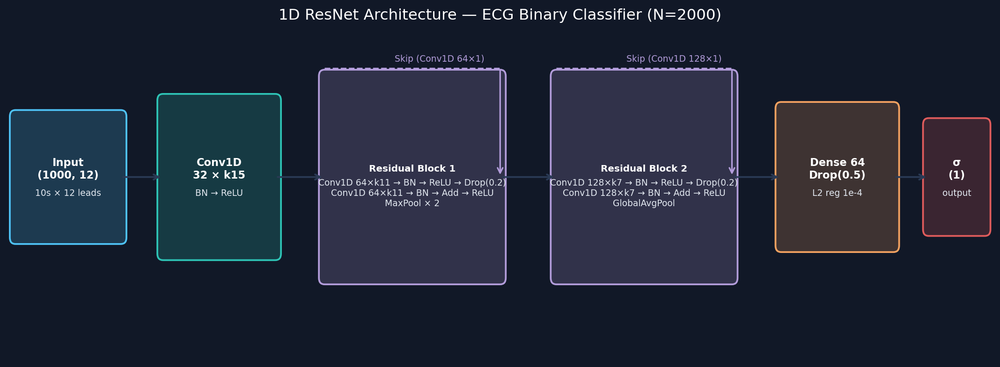

**Confusion Matrix**
<br>
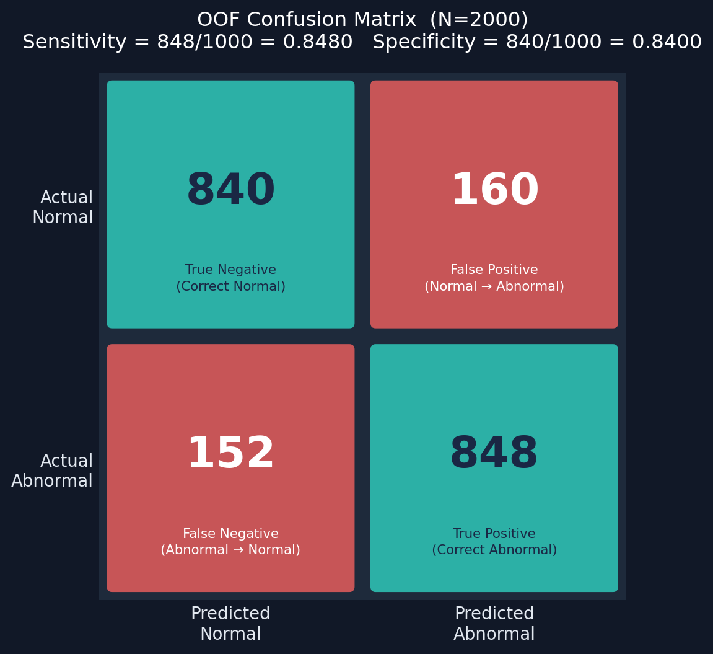

**ROC Curve Performance**
<br>
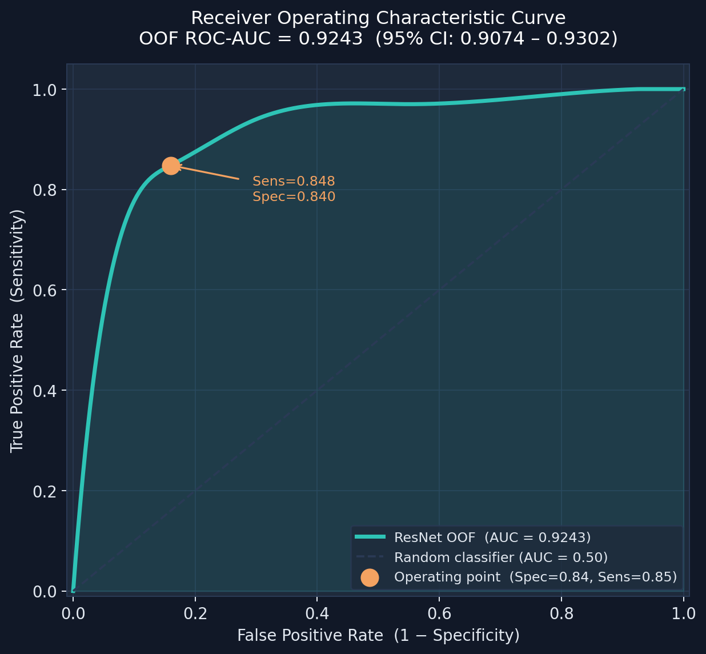

---

### ⚡ Heartbreaker Multimodal Fusion Model

**Architecture Diagram**
<br>
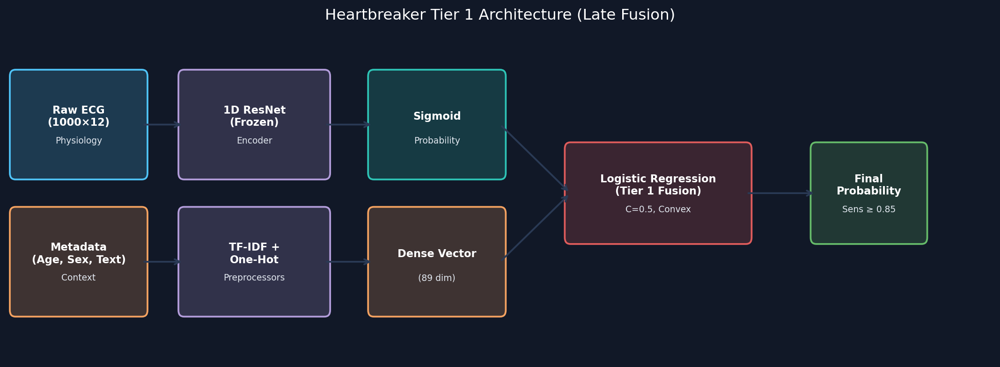

**Confusion Matrix**
<br>
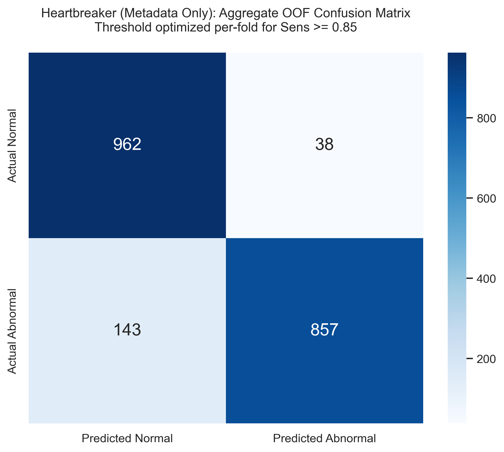

**ROC Curve Performance**
<br>
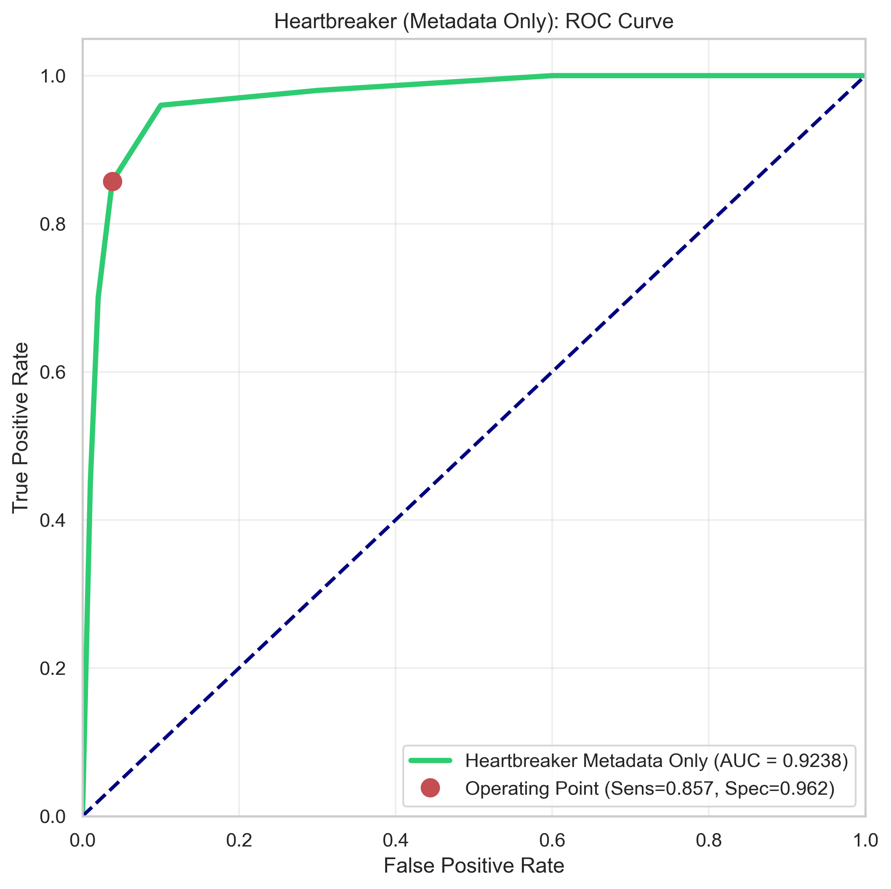

---

### 🩺 Multi-Heartbreaker 5-Label Model

This extension pivots from a binary abnormal/normal framework into a multi-label diagnostic system capable of identifying co-occurring pathologies. The model maps raw waveforms into the following 5 distinct clinical superclasses:

* **NORM (Normal ECG)**: A healthy baseline electrocardiogram showing a regular sinus rhythm without any structurally significant abnormalities.
* **MI (Myocardial Infarction)**: Often referred to as a "heart attack," indicating localized death of heart muscle tissue caused by a sudden blockage in coronary blood supply.
* **STTC (ST/T-Change)**: Abnormalities in the ST segment or T wave. These are critical markers that often indicate early-stage ischemia (reduced blood flow) or repolarization abnormalities.
* **CD (Conduction Disturbance)**: Interruptions or delays in the electrical pathways of the heart, such as Left or Right Bundle Branch Blocks (LBBB/RBBB).
* **HYP (Hypertrophy)**: An abnormal thickening of the heart muscle (e.g., Left Ventricular Hypertrophy). This is typically caused by severe high blood pressure or valve disease, forcing the heart to pump harder.

**Architecture Diagram**
<br>
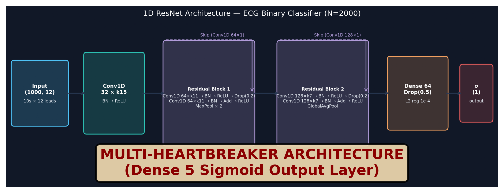

#### A. Multi-Label 1D ResNet (CNN)
* **ROC Curves**:
  
* **Precision-Recall Curves**:
  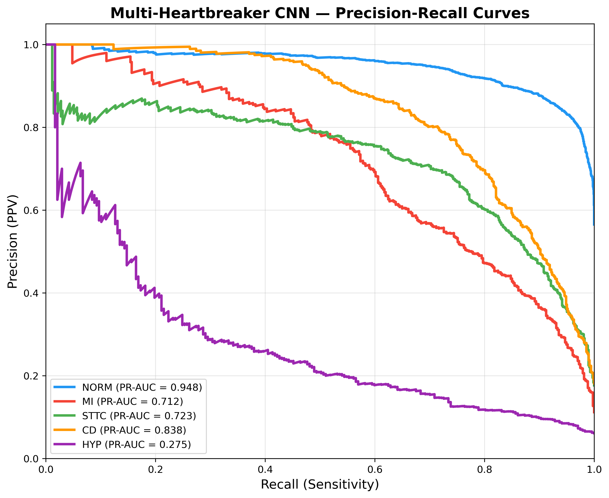
* **Confusion Matrices (Per Class)**:
  

#### B. Multi-Label LightGBM (Clinical Feature Engineering)
* **ROC Curves**:
  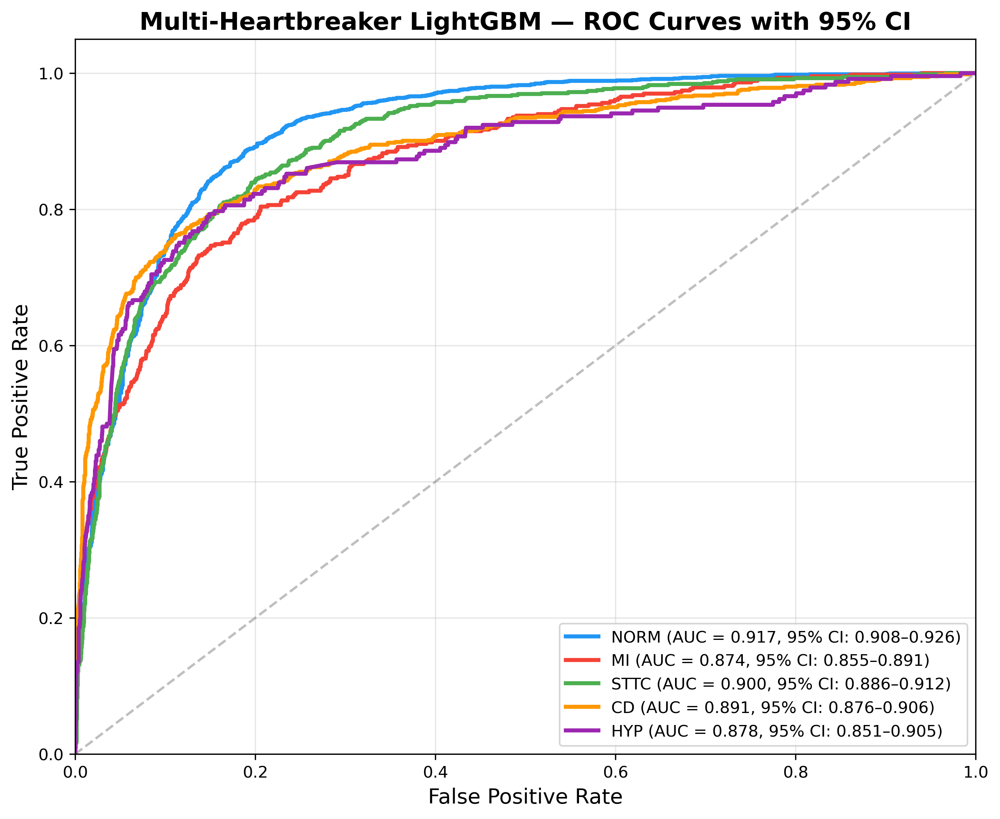
* **Precision-Recall Curves**:
  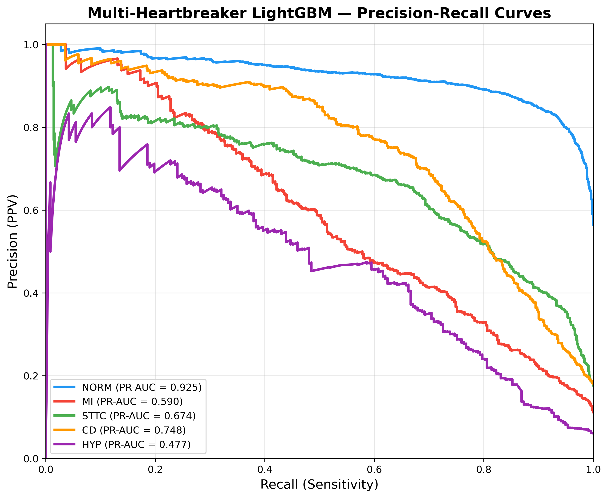
* **Confusion Matrices (Per Class)**:
  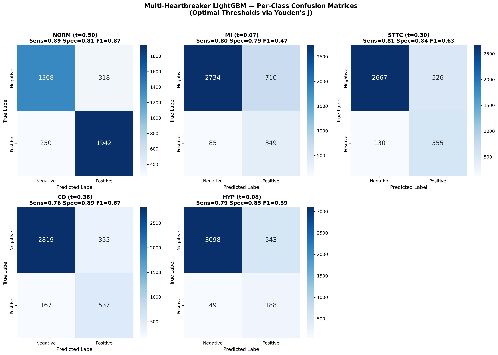

---

### 🔍 Robustness & Ablation Analysis

**Ablation Performance Ladder**
<br>


**Permutation Feature Importance**
<br>
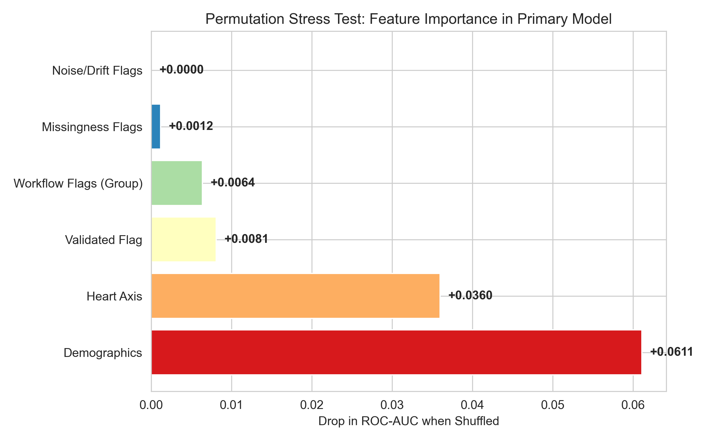

---

## 📱 FVJ CardioAI™ MVP Triage & Diagnostic Product

The **FVJ CardioAI™ MVP** is a clinical decision-support application built using Streamlit and styled with a custom dark-mode glassmorphic theme. It packages all model families into an interactive, clinical-ready system executing real-time inferences on raw time-series data:
* **Unified Main Page Clinical Control Panel:** Places selectors for the Clinical Task (Binary Triage vs. Multi-label), pathology filters, and lead visualizations directly on the main body (preventing control panels from disappearing when the sidebar collapses).
* **Advanced Patient Cohort Filtering:** Filter the clinical validation dataset by demographics (Age, Sex) and pathologies.
* **Model Explainability (Grad-CAM):** Integrated XAI capability to visually highlight the precise temporal sequences of the raw ECG waveform that drove the neural network's diagnostic decision.
* **Automated PDF Clinical Reports:** Generate branded, ready-to-download clinical triage reports containing patient context, raw waveform visualization, probability metrics, and diagnostic verdicts.
* **Seamless Patient Navigation:** Employs session-state Prev/Next navigation buttons to easily flip through patient records.
* **Interactive CSS Progress Bars:** Renders abnormality probabilities dynamically using HTML/CSS progress bars with Youden J cutoff indicators and pastel status badges.
* **Live Validation & Leakage Audit Tab:** Contains a built-in validation engine that checks for patient overlap in real-time to guarantee 0% target leakage across training, validation, and out-of-sample splits.
* **Docker Cloud Containerization:** Fully containerized architecture using `Dockerfile` and `.dockerignore` for immediate, lightweight deployment to cloud environments like Google Cloud Run or AWS Fargate.
* **Launch Instructions:** Run the following command in your terminal:
  ```bash
  streamlit run src/streamlit_dashboard/app.py
  ```
* **Live Demo (Streamlit Cloud):** [ie-deep-learning-group-project.streamlit.app](https://ie-deep-learning-group-project-2qvda3umchrhynwuuhhgbg.streamlit.app/)
* **Local Web Address:** [http://localhost:8501](http://localhost:8501)
* **GitHub Repository URL:** [https://github.com/rvelascarpio/ie-deep-learning-group-project](https://github.com/rvelascarpio/ie-deep-learning-group-project)

> [!TIP]
> **Live Demo:** The deployed dashboard is publicly accessible at **[ie-deep-learning-group-project.streamlit.app](https://ie-deep-learning-group-project-2qvda3umchrhynwuuhhgbg.streamlit.app/)** — no setup required. Running locally, it's served at [http://localhost:8501](http://localhost:8501).

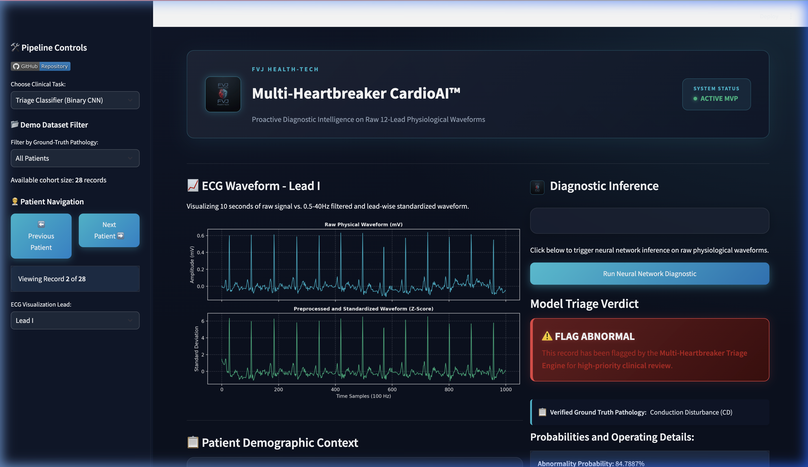

*A full interactive walkthrough demonstrating binary triage, multi-label diagnostic inference, patient navigation, and leakage audits is available at `src/streamlit_dashboard/assets/cardioai_demo.webp`.*

---

## 🚀 Quickstart

> **Python 3.11 is required.** The pinned `tensorflow==2.16.1` ships no wheels for Python 3.12+/3.13 and requires `numpy<2`; on 3.13 the install/launch will hang.

### 1. Environment + dependencies

```bash
conda create -n cardioai python=3.11 -y && conda activate cardioai
# or:  python3.11 -m venv .venv && source .venv/bin/activate
pip install -r requirements.txt
```

### 2. Launch the MVP (runs out of the box)

The repo ships the trained models (`models/*.h5`) **and** a small, leakage‑clean **40‑patient demo cohort** (`data/raw/` + `data/unseen_demo_metadata.csv`), so the dashboard runs immediately — no dataset download or training required:

```bash
streamlit run src/streamlit_dashboard/app.py     # → http://localhost:8501
```

Every prediction is **live**: the selected raw waveform is filtered, normalized, and passed to the Keras model at request time (~0.1 s/ECG). The *Validation & Leakage Audit* tab confirms the demo cohort is patient‑disjoint from training (0 overlap).

### 3. (Optional) Reproduce the full pipeline from scratch

```bash
python src/data_processing/download_ptbxl_2000.py         # fetch the 2,000-patient training subset
python src/model_training/train_1d_ecg_model.py           # train 1D ResNet (StratifiedGroupKFold by patient_id)
python src/model_training/train_multimodal_ecg_model.py   # train the Heartbreaker fusion model
python src/model_evaluation/run_heartbreaker_stress_tests.py   # ablations + permutation importance
python src/data_processing/build_demo_cohort.py --src data/raw # rebuild the unseen demo cohort
```

### 4. Deploy to Streamlit Community Cloud

> ✅ **Already live:** this repo is deployed from `main` at **[ie-deep-learning-group-project.streamlit.app](https://ie-deep-learning-group-project-2qvda3umchrhynwuuhhgbg.streamlit.app/)**. The steps below reproduce that deployment.

1. Push this repo to GitHub. The demo data is committed; the large `data/Imagenes eco/` source pool is git‑ignored.
2. On [share.streamlit.io](https://share.streamlit.io) → **New app**, select the repo, set **Main file path** to `src/streamlit_dashboard/app.py`.
3. In **Advanced settings**, set **Python version → 3.11** (required for TensorFlow 2.16.1).
4. Deploy — the app loads the committed models + demo cohort and runs live inference with no secrets or external data.

---

## 📁 Core Repository Structure

* **`src/model_training/train_1d_ecg_model.py`**: Builds, trains, and calibrates the 2-block 1D ResNet using raw signal waveforms.
* **`src/model_training/train_multimodal_ecg_model.py`**: Integrates demographic data and frozen ECG signal embeddings into a multimodal classifier.
* **`src/model_training/train_multiclass_ecg_model.py`**: Multi-Heartbreaker 5-class extension predicting NORM, MI, STTC, CD, and HYP.
* **`src/model_evaluation/run_heartbreaker_stress_tests.py`**: Evaluates the multimodal model under permutation shuffling and performs feature ablation stress tests.
* **`src/streamlit_dashboard/app.py`**: Interactive Streamlit application simulating the clinical triage dashboard using held-out test signals.
* **`src/data_processing/multimodal_data_prep.py`**: Handles clean parsing, missingness encoding, and preprocessing of demographic variables.
* **`reports/final_ecg_report.md`**: Detailed final report detailing validation framework, correction of bugs, and experimental narratives.
* **`reports/validation_report.md`**: In-depth threshold sweep analysis, confusion matrices, and metrics of the raw 1D pipeline.
* **`reports/heartbreaker_validation_report.md`**: Validation guide, stress test metrics, and ablation logs for the Multimodal extension.
* **`reports/multiclass_validation_report.md`**: Validation guide, class breakdown, and leakage audits for the Multi-label model.
* **`reports/methodology_guide.md`**: Mathematical details on focal loss, Z-normalization, Platt calibration, and bootstrap confidence intervals.

---

## 👥 Contributors

* **[Jan Wejchert](https://github.com/janwejchert)**
* **[Pipe10101](https://github.com/Pipe10101)**
* **[Vlad494-cmd](https://github.com/Vlad494-cmd)**
* **[ricardo-velasquez](https://github.com/rvelascarpio)**
