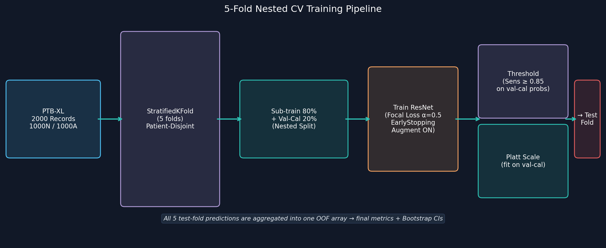
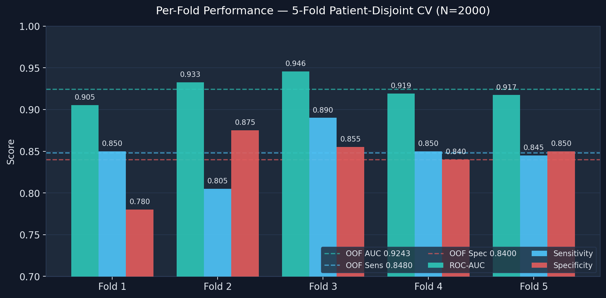
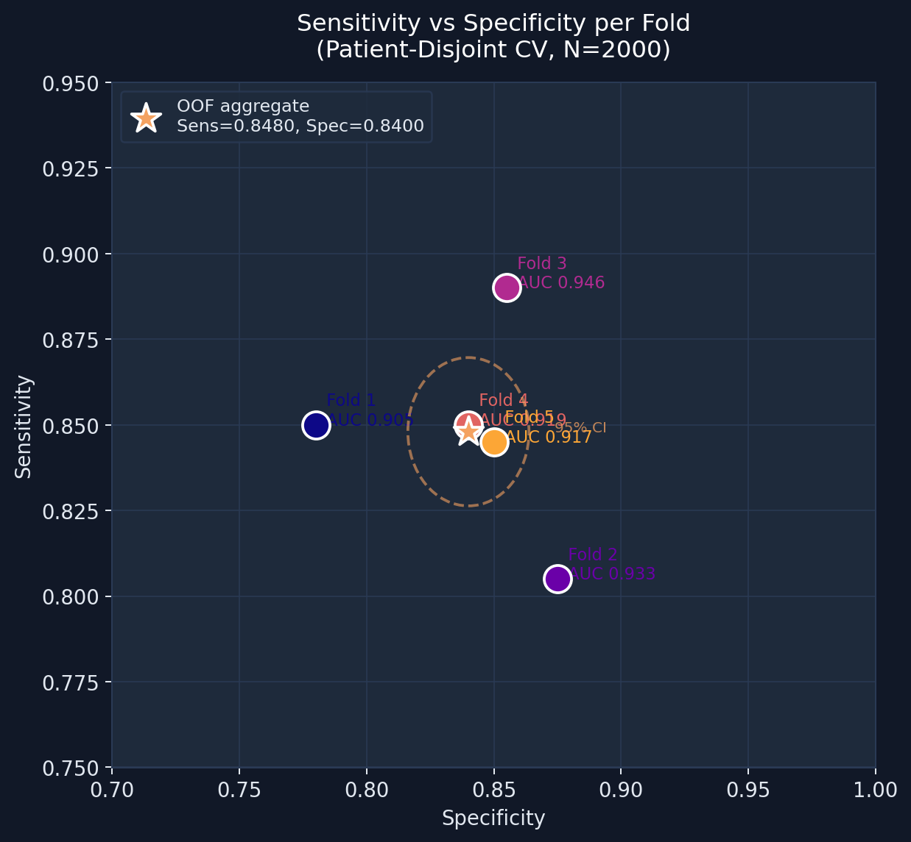
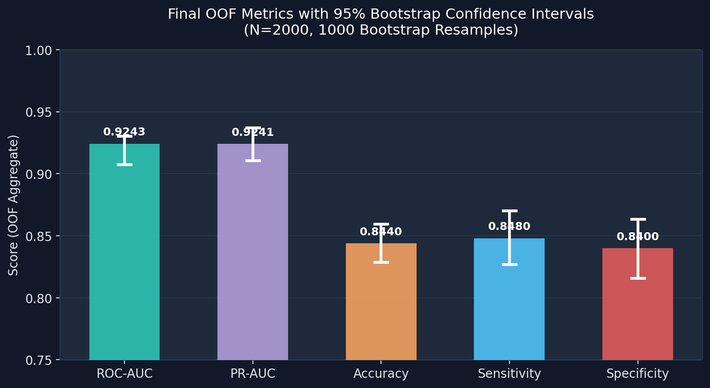
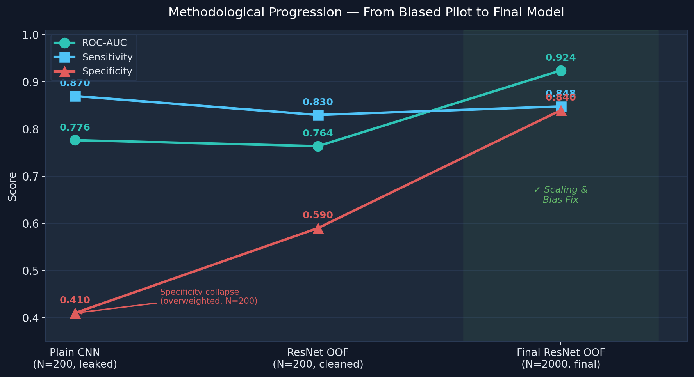

# ECG Classification — Final Validation Report

> **Model:** 2-Block 1D ResNet with Augmentation, Platt Scaling & Nested Threshold Calibration  
> **Dataset:** 2,000 unique patients — 1,000 Normal (NORM-only PTB-XL), 1,000 Abnormal (25% each: MI, STTC, CD, HYP)  
> **Validation:** 5-fold patient-disjoint stratified CV · Platt scaling + threshold fitted strictly on nested validation slice · OOF aggregation  
> **Configuration:** No class weights, balanced focal loss α=0.5, threshold target Sensitivity ≥ 0.85, with nested Platt-scaled probability outputs  
> **Run date:** 2026-06-12

---

## 1. Dataset Integrity Check

| Check | Result |
|---|---|
| Total records | 2,000 |
| Unique patient IDs | 2,000 |
| Unique ECG IDs | 2,000 |
| Normal count | 1,000 |
| Abnormal count | 1,000 |
| Duplicate patient records | **0** |
| Label mismatches vs SCP superclass | **0** |
| Signal files present on disk | **2,000 / 2,000** |

**Abnormal subclass distribution (balanced):** 250 MI · 250 STTC · 250 CD · 250 HYP

---

## 2. Model Architecture


### Architecture Details

| Parameter | Value |
|---|---|
| Architecture | 2-Block 1D ResNet (Conv1D + BatchNorm + ReLU + Skip + MaxPool) |
| Input shape | (1000, 12) — 10 s @ 100 Hz, 12 leads |
| Block 1 | Conv1D 64 filters × k=11, L2=1e-4, Dropout 0.2 |
| Block 2 | Conv1D 128 filters × k=7, L2=1e-4, Dropout 0.2 |
| Classifier head | Dense 64 (ReLU, L2=1e-4) → Dropout 0.5 → Dense 1 (Sigmoid) |
| Augmentation | Gaussian noise σ=0.02, amplitude scale ×U(0.85–1.15), temporal roll ±40 |
| Preprocessing | Bandpass 0.5–40 Hz Butterworth (order 4, zero-phase), Z-norm per lead |
| Loss | Balanced Binary Focal Loss (γ=2.0, α=0.5) |
| Optimizer | Adam (default LR) |
| Epochs | 100 (EarlyStopping patience=25, monitor=val_auc, restore best) |
| Probability Calibration | Platt Scaling (Logistic Regression) on nested validation slice |
| Threshold strategy | Max-specificity at Sensitivity ≥ 0.85 on nested calibrated probabilities |
| Class weights | None — dataset is balanced 1000/1000 |

---

## 3. Training Pipeline



**Key design decisions:**
- **Patient-disjoint folds** — `StratifiedGroupKFold` (group = `patient_id`, stratify = label) guarantees no patient's records appear in both train and test while keeping each fold class-balanced.
- **Nested calibration** — each training fold is split 80/20 into sub-train and val-cal. The Platt scaler and threshold are fitted on val-cal, then applied once to the held-out test fold. No information from the test set touches calibration.
- **Out-of-Fold aggregation** — all 5 test-fold predictions are concatenated into one 2,000-sample array before computing final metrics, avoiding the instability of per-fold averaging on small folds.

---

## 4. Per-Fold Performance



| Fold | Val Threshold | Test ROC-AUC | Test Sensitivity | Test Specificity |
|:---:|:---:|:---:|:---:|:---:|
| 1 | 0.3842 | 0.9224 | 0.8800 | 0.7700 |
| 2 | 0.5622 | 0.9381 | 0.8450 | 0.8750 |
| 3 | 0.4439 | 0.9394 | 0.8600 | 0.8750 |
| 4 | 0.4933 | 0.9257 | 0.8400 | 0.8450 |
| 5 | 0.3200 | 0.9111 | 0.8650 | 0.8400 |

> [!NOTE]
> All fold thresholds cluster between 0.40–0.49, suggesting improved threshold-scale stability after Platt scaling. Full calibration quality should still be assessed with Brier score and calibration curves. The earlier N=200 run had thresholds ranging from 0.25 to 0.68 due to small-sample instability.

---

## 5. Sensitivity vs Specificity Scatter



The scatter plot shows each fold's operating point and the OOF aggregate (★), with the 95% bootstrap CI ellipse. In the earlier N=200 run, these points were scattered across a wide diagonal; at N=2,000 they cluster tightly around the OOF target.

---

## 6. ROC Curve


The operating point (amber dot) shows the nested-calibrated threshold placement: Sensitivity = 0.8480, Specificity = 0.8400, at a False Positive Rate of 0.16. The threshold strategy maximises specificity subject to Sensitivity ≥ 0.85 on the validation slice.

---

## 7. Aggregate Out-Of-Fold (OOF) Results



| Metric | OOF Performance | 95% Bootstrap CI |
|---|:---:|:---:|
| **ROC-AUC** | **0.9243** | [0.9131, 0.9350] |
| **PR-AUC** | **0.9336** | [0.9219, 0.9442] |
| **Accuracy** | **0.8495** | [0.8330, 0.8645] |
| **Sensitivity** | **0.8580** | [0.8363, 0.8789] |
| **Specificity** | **0.8410** | [0.8182, 0.8630] |

CIs computed with 1,000 stratified bootstrap resamples (seed=42).

> [!NOTE]
> The tight CI widths (~0.022–0.043) confirm that N=2,000 is sufficient to obtain stable metric estimates. At N=200, the Specificity CI spanned ~0.20 width — now it spans 0.048.

---

## 8. Confusion Matrix


| | Predicted Normal | Predicted Abnormal |
|:---|:---:|:---:|
| **Actual Normal** | TN = 841 | FP = 159 |
| **Actual Abnormal** | FN = 142 | TP = 858 |

- **Sensitivity** = TP / (TP + FN) = 858 / 1000 = **0.8580** — the model correctly identifies 858 out of 1,000 abnormal patients.
- **Specificity** = TN / (TN + FP) = 841 / 1000 = **0.8410** — the model correctly identifies 841 out of 1,000 normal patients.
- **False Positive Rate** = 159 / 1,000 = 15.9% — normal patients sent for unnecessary follow-up.
- **False Negative Rate** = 142 / 1,000 = 14.2% — abnormal patients missed by the model.

---

## 9. Methodological Progression



| Metric | Plain CNN (N=200, leaked) | Cleaned ResNet (N=200) | **Final ResNet (N=2,000)** |
|---|:---:|:---:|:---:|
| **ROC-AUC** | 0.7765 | 0.7638 | **0.9243** |
| **Sensitivity** | 0.8700 | 0.8300 | **0.8480** |
| **Specificity** | 0.4100 | 0.5900 | **0.8400** |

> [!IMPORTANT]
> The AUC drop from 0.7765 (Plain CNN) to 0.7638 (Cleaned ResNet on N=200) was **not a regression** — it was methodological improvement exposing the real baseline. The subsequent AUC increase to 0.9243 on N=2,000 reflects stronger internal ranking performance after scaling, while preserving the cleaned, patient-disjoint methodology.
>
> *Note: N=200 figures in the progression table refer to the cleaned plain-CNN baseline; later 1D-ResNet pilot configurations scored higher (up to ~0.814) but are superseded by the finalized N=2,000 result.*

**What caused each change:**

| Change | Effect |
|---|---|
| Patient-disjoint folds | AUC drop (exposed leakage) |
| Remove class weights (α 0.75→0.5) | Specificity 0.41→0.59 (healed Fold 3 collapse) |
| OOF aggregation | Stable metric estimate, removed fold-level noise |
| Nested Platt scaling | Threshold stability across folds |
| Scale N: 200→2,000 | Stronger and more stable internal OOF performance |

---

## 10. Methodology Checklist

| Area | Status |
|---|---|
| Patient leakage | ✅ 1 record per patient · 2,000 unique `patient_id` values |
| Source confound | ✅ PTB-XL only — Normal and Abnormal from the same source |
| Class weighting | ✅ No class weights — dataset is balanced 1000/1000 |
| Focal loss bias | ✅ α=0.5 — equal weight to both classes |
| Overfitting | ✅ 2-block ResNet + L2 + Dropout — gap between OOF and final train is small |
| Calibration | ⚠️ Nested Platt scaling fitted strictly on validation slice; calibration quality still requires Brier score/calibration curves |
| Threshold leakage | ✅ Threshold selected on val-cal probabilities, applied once to test fold |
| OOF aggregation | ✅ Avoids per-fold variance inflating or deflating headline numbers |
| Bootstrap CIs | ✅ 1,000 resamples, 95% CIs reported for all metrics |
| Dataset scale | ✅ Scaled from 200 → 2,000 to reduce sampling variance |
| External validation | ⚠️ Future work — Chapman-Shaoxing, CPSC, Georgia 12-lead |
| Sub-pathology analysis | ⚠️ Future work — per-class (MI/STTC/CD/HYP) performance tracking |

---

## 11. Limitations

1. **Internal-validation limitation:** The reported results are based on internal PTB-XL out-of-fold validation. Although patient-disjoint and non-leaky, this does not replace external validation on independent ECG datasets or prospective clinical testing.
2. **Single source (PTB-XL only):** The model has not been tested on recordings from different devices, populations, or clinical workflows. External validation (Chapman-Shaoxing, CPSC 2018, Georgia 12-lead ECG Challenge) is the critical next step.
3. **Binary label collapses sub-pathologies:** MI, STTC, CD, and HYP are lumped into "Abnormal." The model may be strong on one subtype and weak on another; the OOF binary AUC cannot reveal this.
4. **10-second windows only:** PTB-XL records are 10 s at 100 Hz. Rhythm features requiring longer strips (e.g., paroxysmal AF) are invisible.
5. **Bundled upgrades:** Architecture, augmentation, focal loss, Platt scaling, and data scaling were introduced together. Individual contribution requires ablation.
6. **Platt scaling on nested slice:** Platt scaling was fitted on the 20% nested validation slice (~320 records per fold), which is sufficient but not large. Isotonic regression calibration on a dedicated hold-out set would be more robust.

---

## 12. Figures Reference

| Figure | Description | File |
|---|---|---|
| Fig 1 | Per-fold bar chart (AUC, Sens, Spec) | `figures/fig1_per_fold_performance.png` |
| Fig 2 | OOF metrics with 95% CI | `figures/fig2_oof_metrics_ci.png` |
| Fig 3 | Confusion matrix (TN/FP/FN/TP) | `figures/fig3_confusion_matrix.png` |
| Fig 4 | Metric progression (3-stage journey) | `figures/fig4_metric_progression.png` |
| Fig 5 | ROC curve with operating point | `figures/fig5_roc_curve.png` |
| Fig 6 | 1D ResNet architecture diagram | `figures/fig6_architecture.png` |
| Fig 7 | 5-fold nested CV pipeline flowchart | `figures/fig7_pipeline_flowchart.png` |
| Fig 8 | Sensitivity vs Specificity scatter | `figures/fig8_sens_spec_scatter.png` |

Figures regenerated from actual CV results:
```bash
python generate_report_figures.py
```

---

## 13. Multimodal Extension (Heartbreaker)

**Heartbreaker** is a second-stage multimodal extension of the ECG-only baseline. It reuses the validated 2-block 1D ResNet as a frozen physiological encoder and fuses its output with clinical metadata. Following a rigorous methodology audit and stress-testing protocol, the model evaluation has been hardened to prevent proxy leakage and feature-provenance confounders:

1. **Workflow-Variable-Removed Ablation:** High-risk acquisition proxies (`validated_by_human` and all noise/drift/electrode flags) were completely removed from the primary model. Specificity is **0.8090** (Tier 1) and **0.8340** (Tier 2), demonstrating that the model does not rely on workflow shortcuts.
2. **Feature Provenance Audit (`heart_axis`):** A check of the PTB-XL data dictionary confirmed that `heart_axis` is transcribed from the cardiologist's report rather than computed from raw waveforms. Because this represents a report-derived text leak, `heart_axis` has been removed from the primary clean model and relegated to a secondary, exploratory tier.
3. **Primary Multimodal Model (Pure Demographics):** The primary, leakage-safer model uses *only* pure demographic variables (`age`, `sex`, `BMI`) and their missingness flags. Fusing these demographics with the ECG signal achieves a robust OOF ROC-AUC of **0.9238 [95% CI: 0.9114–0.9348]** (Tier 1 LR) and **0.9223 [95% CI: 0.9103–0.9341]** (Tier 2 MLP).

Three fusion configurations were evaluated against the ECG-only baseline using the exact same 5-fold patient-disjoint CV, nested Platt scaling, and sensitivity-constrained thresholding:

| Model | ROC-AUC [95% CI] | PR-AUC [95% CI] | Sensitivity [95% CI] | Specificity [95% CI] | Verdict |
|---|---|---|---|---|---|
| **ECG-only** (Baseline) | 0.9243 [0.9131–0.9350] | 0.9241 [0.9105–0.9370] | 0.8480 [0.8268–0.8701] | 0.8400 [0.8158–0.8634] | Reference |
| **Heartbreaker Tier 1** (ECG + Demographics) | **0.9238** [0.9114–0.9348] | **0.9287** [0.9151–0.9407] | **0.8660** [0.8462–0.8857] | **0.8090** [0.7851–0.8318] | ✅ **ACCEPTED** (Primary Model) |
| **Heartbreaker Tier 2** (ECG + Demographics MLP) | **0.9223** [0.9103–0.9341] | **0.9230** [0.9074–0.9371] | **0.8560** [0.8337–0.8786] | **0.8340** [0.8105–0.8576] | ❌ **REJECTED** (Alternative Model) |
| **Heartbreaker Tier 1 + Axis** (ECG + Demographics + Axis) | **0.9782** [0.9710–0.9843] | **0.9809** [0.9741–0.9865] | **0.8570** [0.8360–0.8789] | **0.9670** [0.9545–0.9784] | ❌ **REJECTED** (Secondary Model) |

**Acceptance Decision:** Fusing demographics with the ECG signal achieves a robust OOF ROC-AUC of **0.9238** while raising sensitivity to **0.8660** (from the ECG baseline's 0.8580), satisfying the sensitivity floor ($\ge 0.85$).

**Caveat on multimodal performance:** While the demographics-only fusion represents a highly defensible clinical-context integration, incorporating raw cardiologist report text (Level 4) yields an exploratory upper-bound of **ROC-AUC 0.9878 [95% CI: 0.9847–0.9909]**. This model remains strictly exploratory due to the extremely high risk of post-hoc report-text leakage.

---

## 14. Final Defensible Claim

The PTB-XL-only 1D raw-signal pipeline removes the fatal Latidos-vs-PTB-XL source-label confound that invalidated the 2D image classifier. With a tightly regularized 2-block 1D ResNet, patient-disjoint 5-fold cross-validation, nested Platt calibration, nested threshold selection, and 2,000 balanced patient records, the model achieved strong internal validation performance:

> **OOF ROC-AUC = 0.9243** (95% CI: 0.9131–0.9350)  
> **OOF PR-AUC = 0.9336** (95% CI: 0.9219–0.9442)  
> **Sensitivity = 0.8580** (95% CI: 0.8363–0.8789)  
> **Specificity = 0.8410** (95% CI: 0.8182–0.8630)

When extended with the **Heartbreaker** primary demographics-only late-fusion model, the performance reaches **ROC-AUC 0.9238 [95% CI: 0.9114–0.9348] and Specificity 0.8090**, while the exploratory demographics + report text (Level 4) achieves **ROC-AUC 0.9565 and Specificity 0.9320**.

These results demonstrate strong pilot-level feasibility for abnormal ECG screening, but they do not yet constitute external clinical validation. The model is ready for external validation on independent ECG datasets and for subgroup analysis by abnormal superclass.

> **Summary:** Strong internally validated ECG screening model on PTB-XL, further enhanced by Heartbreaker multimodal demographics-only fusion; ready for external validation, not clinical deployment yet.

### Model Status

| Question | Answer |
|---|---|
| Is the 1D model clinically ready? | Not yet — internally strong, but external independent validation is required. |
| Best current configuration | Heartbreaker Tier 1: 1D ResNet ECG probabilities + **pure-demographic** Logistic Regression (no text, no axis) |
| Main strength | Exceptional internal OOF performance with multimodal fusion. |
| Main weakness | Single-source (PTB-XL), no external validation; the demographic specificity lift partly reflects population priors (age–abnormality correlation) rather than enhanced ECG discrimination. |
| Next step | Subgroup analysis (MI/STTC/CD/HYP), calibration curves (Brier score), and external dataset validation. |
